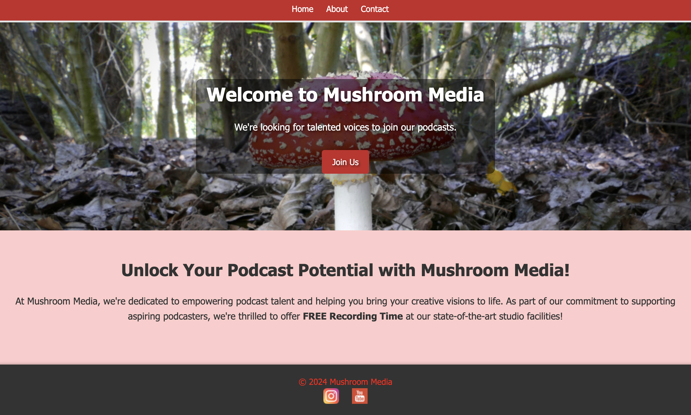
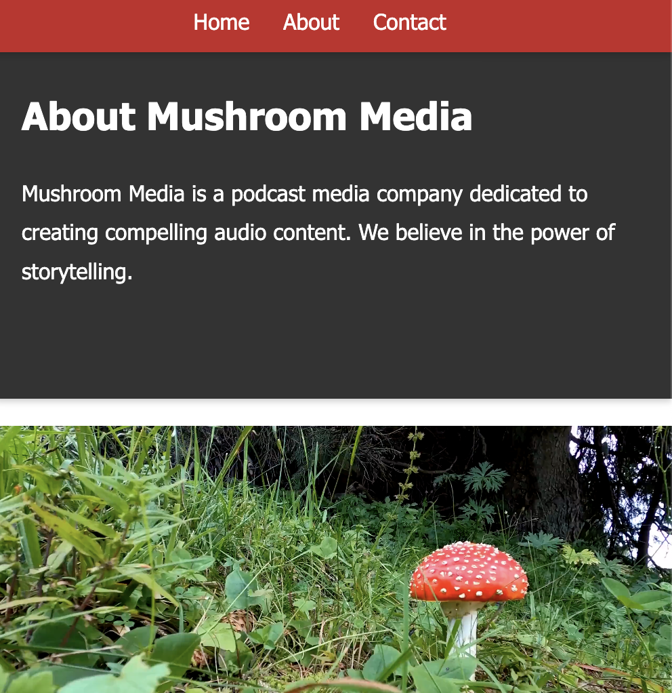
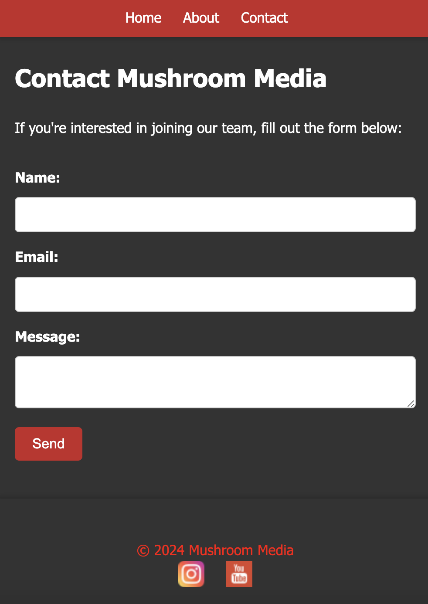

# Mushroom Media

Mushroom Media is a platform dedicated to providing fun . Our goal is to connect podcasters with audiences, the website is designed to attract and sign up new talent.

## Features

### Navigation Bar

- Easily navigate through the site with the responsive navigation bar.
- Access key sections including Home, About and Contact.
- Pulled ontop of everything to ensure it's always easily accessible.

### Home Page

- Home page with large hero image to draw in the talent, intentionally placed "join us" button for quick conversion.
- Designed simply, to look great for handheld and larger devices.
- Special offer section, bright, to highlight the content

### About Page

- Short description of mushroom media and what we offer.
- Video with control sticking with the theme of mushrooms of course.

### Contact Page

- Reach out to us directly using the contact form.
- Colour scheme chosen for professional look.

### Footer

- Find quick links to our social media profiles for further engagement.
- Stay connected with the Mushroom Media community across various platforms.

## Future Feature

-Timeline of goals on about page.

## Testing

- Conducted thorough manual testing as displayed on table below.

| Item           | Test               | Result |
| -------------- | ------------------ | ------ |
| Nav Bar        | Manual Click       | Pass   |
| Join Us Button | Manual Click       | Pass   |
| Footer         | Manual Click       | Pass   |
| Responsiveness | Inspect Function   | Pass   |
| Video Control  | Manual Click       | Pass   |
| Contact Form   | Entered Details    | Pass   |
| HTML           | W3C Validator      | Pass   |
| CSS            | (jigsaw) Validator | Pass   |

## Issues
- Codeanywhere continuosly breaking and not commiting despite all correct authentications and repository path.
- Lack of JavaScript rendering the interactive Timeline unable to be completed.

## Deployment

- Deployed the Mushroom Media website to GitHub Pages for easy access.
    
    Navigate to Repository Settings:
- Go to your GitHub repository for the website.
- Select the Master Branch as the Source:
- Inside the repository, click on the "Settings" tab.
    Choose Branch for GitHub Pages:
- In the settings menu, scroll down to the "GitHub Pages" section.
- Under "Source", you'll find a drop-down menu. Click on it.
- Select "Master Branch" from the drop-down menu.
    Save Changes:
- After selecting the master branch, GitHub Pages will automatically refresh to indicate the successful deployment.
- If there's a confirmation or save button, make sure to click it to save your changes.
    Verification:
- Once the settings are saved, GitHub Pages will automatically deploy your website from the master branch.
- You can verify the deployment by visiting the URL provided in the GitHub Pages section of the repository settings. It usually follows the format: https://<username>.github.io/<repository-name>.

## Credits

- Content: 
  - The contact form validation was modeled off the LOVES RUNNING project
  - The layout of the README.md was modeled off the LOVES RUNNING project
  - The Icons for the footer and favicon were downloaded from open source website "UXwing"

- Media:
  - The hero photo was taken from open source website 'FreePik"
  - The video was taken from open source website "Pixabay"
